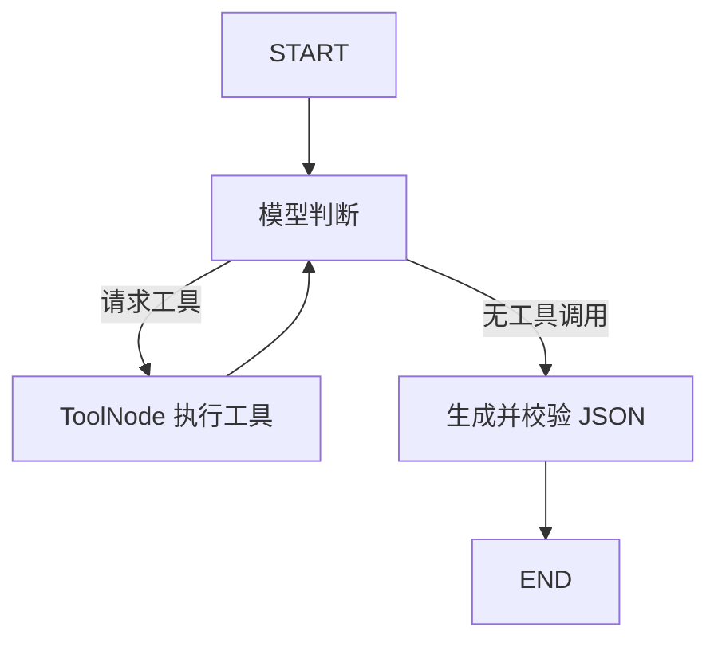

# week2：LangGraph 日志分析与任务分配

参照 week1 的业务链路，实现日志补全、Java 源码检索、结构化故障分析、查询团队成员与任务分配。week1 保留原样。

## 运行

需要 Python 3.10+，建议继续使用 Python 3.11。

在项目根目录执行：

```powershell
python -m pip install -r src/week2/requirements.txt
Copy-Item .env.example .env
# 编辑 .env，填入自己的 DEEPSEEK_API_KEY
python src/week2/group/main.py
```

Linux/macOS 将 `Copy-Item` 换为 `cp`。如果已经有 `.env`，直接补充配置，不要覆盖。

支持模块入口，也支持在 `src/week2/group` 中执行 `python main.py`：

```powershell
python -m src.week2.group.main
python src/week2/group/main.py --log "UserService 启动失败" --src-base "D:/NOAH-proj/securities" --max-rounds 8
```

默认源码目录通过 `__file__` 定位到 week2/test/test_codebase，不依赖启动目录。自定义的相对目录以启动目录为基准，入口会转换成绝对路径。

模型默认沿用原 week2 的 `deepseek-chat`，可以通过 `DEEPSEEK_MODEL` 覆盖；选择的模型必须支持工具调用和 JSON 输出。模型仅在运行时创建，导入模块与离线测试不需要密钥。

## 图如何执行

外层 `workflow.py`：`START → log_reviewer → team_leader → END`。

每个 Agent 内部 `agents/agent_runner.py`：



- 三个工具使用 `@tool` 自动生成参数说明，交给 `bind_tools` 和 `ToolNode`；不再维护手写工具 schema 或 if/else 执行器。
- `add_messages` 累积历史，工具结果作为带调用 ID 的 `ToolMessage` 返回模型，一轮可执行多个工具。
- 日志 Agent 仅绑定 `get_full_log`、`search_code`；Leader 仅绑定 `get_team_members`。
- 在 Agent 中，`search_code` 的模型参数只有 `keyword`，`src_base` 由程序绑定。直接测试工具时仍用 `search_code.invoke({"src_base": ..., "keyword": ...})`。
- 参数错误、未知工具和工具执行异常以错误消息返回模型。目录不存在以原来的 `success/error` 结构返回，不自动换目录。
- 每个 Agent 最多进行 `max_rounds` 次工具决策模型调用（含最后一次无工具调用）；超过上限抛出异常，另有图步数上限。JSON 输出节点会额外调用模型一次。
- JSON 输出通过 `with_structured_output(..., method="json_mode")` 生成，再由 Pydantic 验证字段、列表长度和 confidence 范围。JSON 模式不是服务端严格 schema 保证，验证失败会抛异常。
- 任务分配前必须成功查询成员，程序拒绝分配给查询结果中不存在的人。

## 文件

| 文件 | 职责 |
| --- | --- |
| group/main.py | 命令行入口与结果展示 |
| group/workflow.py | 外层状态与两个 Agent 的衔接 |
| group/agents/agent_runner.py | 通用工具循环图 |
| group/agents/log_reviewer.py | 日志分析与固定源码目录 |
| group/agents/team_leader.py | 成员查询、任务分配与成员校验 |
| group/schemas.py | 与 week1 对齐的结果字段 |
| group/tools/ | 三个 LangChain 工具，由 LangGraph 调用 |
| group/client_manager.py | 延迟创建 DeepSeek 模型 |

`review_log(log_receive, src_base)` 与 `task_management(log_analysis)` 保留 week1 的调用形式。`run_workflow` 返回包含 `log_analysis` 和 `task_assignment` 的状态字典。程序只展示任务分配结果，不发送任务。

完整日志与团队成员沿用 week1 的内置示例数据；源码搜索实际读取本地 Java 文件。本次实现范围是分析与分配，尚未修改或自动修复 Java 文件。

## 离线验证

```powershell
python -m pip install -r src/week2/requirements-dev.txt
python -m pytest src/week2/test -q
```

测试用脚本模型驱动真实 LangGraph 和三个本地工具，验证两 Agent 衔接、多工具调用、ToolMessage ID、固定源码目录、异常、轮数上限、结果校验和成员约束。另用 HTTP 模拟传输验证实际 ChatDeepSeek 适配器的工具格式及 JSON 模式。测试不访问真实模型、不收费，不能替代真实密钥下的在线验证。
